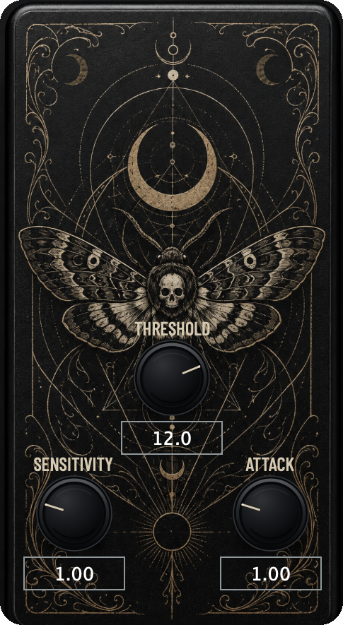

# AdaptiveGate

**A multiband-aware noise gate that opens and closes as one coherent signal — never a comb-filtered mess of independently-switching frequency bands.**

## What it does

Most gates either work broadband (one envelope follower, one threshold, blind to what part of the spectrum actually triggered it) or split the signal into bands and gate each one separately — which fixes the "triggers on the wrong content" problem but introduces a new one: different bands opening and closing at slightly different moments, smearing transients and leaving the gated result sounding filtered and hollow.

AdaptiveGate splits the signal into frequency bands **for detection only**. Each band gets its own envelope follower and an adaptive noise-floor tracker, so the plugin always knows whether a given band currently holds signal above its own local noise floor. But the actual gating action is a **single global gain** applied to the untouched, full-band signal — never re-summed from separately-gated bands. At every sample, whichever band shows the strongest evidence (the highest signal-to-noise excess above its own margin) "drives" the global open/close decision, and that band's attack/hold/release timing is what the global envelope follows for that instant. The result: the gate reacts using whichever part of the spectrum most clearly contains real signal, but the whole mix always opens and closes together, as one sound.

Key mechanisms behind that:

- **Adaptive noise-floor tracking per band** — a fast-falling, slow-rising asymmetric tracker (so a loud transient is never mistaken for a new, higher noise floor) blended with a rolling minimum-statistics percentile estimate, so the gate keeps adapting to a room or a source's noise character over time instead of relying on a single fixed threshold.
- **Soft, sigmoid decision curve** — the gate doesn't hard-switch between open and closed; it computes a probability-like gain from how far the driving band's SNR sits past its threshold, shaped by a sigmoid whose steepness is the Sensitivity control. The result can feel anywhere from a soft, musical fade to a snappy on/off switch.
- **Hysteresis (Schmitt-trigger) state** — opening and closing use different effective thresholds once the gate is already in a state, specifically to prevent chatter on signal that hovers right at the threshold.
- **Transient protection** — a fast rise-rate detector can force the gate open even if the tracked SNR hasn't caught up yet, so sharp attacks (a pick, a snare hit, a plosive) aren't clipped off at the front.
- **Source-optimized profiles** — Speech, Guitar, Distorted Bass, Drum (Close Mic) and Drum (Overhead) each ship with their own crossover points, per-band margins, and timing defaults tuned for that material, so dialing in a working starting point takes one click, not five.

## Two views, one engine

- **Pedal view** — a compact, stompbox-style panel with just the three controls you reach for in the moment: **Threshold**, **Sensitivity**, and **Attack** (Source is pinned to Guitar in this view). This is the default view on launch.
- **Native / Advanced view** — the full control surface. The Overview mode adds **Range** and **Bypass** to the pedal-view set; toggling **Advanced** swaps Sensitivity out for direct access to **Attack**, **Hold**, **Release**, and **Hysteresis**.

Every control shows a tooltip on hover with a short explanation and its exact value range.

## Presets

A preset bar above the controls saves and recalls every parameter (Source through Bypass) under a name. Presets are stored as individual XML files in `~/Library/Application Support/Moth Production/AdaptiveGate/Presets`.

## Parameter reference

| Parameter | Range | Default | Unit | What it does |
|---|---|---|---|---|
| **Source** | Speech / Guitar / Distorted Bass / Drum (Close Mic) / Drum (Overhead) | Guitar | — | Selects the frequency-band profile matched to the material: crossover points, per-band detection margins, and the attack/hold/release/sigmoid-steepness defaults each band contributes when it drives the global decision. |
| **Threshold** | -24 … +24 | 0 | dB | Offset applied to every band's detection margin at once. Positive values make the gate stricter (opens only on a stronger signal-to-noise ratio, cuts more); negative values make it more permissive. |
| **Sensitivity** | 0.1 … 4.0 | 1.0 | × | Multiplies the steepness of the global sigmoid decision curve. Higher values make the open/closed transition snappier and more switch-like; lower values make it more gradual and soft. Pedal-view control; replaced by Attack/Hold/Release/Hysteresis in the Native view's Advanced mode. |
| **Range** | 0.0 … 1.0 | 0.0 | linear gain | The floor gain the gate settles to when fully closed. 0.0 mutes completely; higher values (e.g. ~0.1, roughly -20dB) leave a floor the gate never drops below — useful for a gentle attenuation instead of a hard mute. At 1.0 the gate has no audible effect. Native view only. |
| **Attack** | 0.1× … 4.0× | 1.0× | × multiplier | Multiplies the driving band's base attack time. Higher values open the gate more slowly once signal appears; lower values open faster. One of the three Pedal-view knobs; also reachable in the Native view's Advanced mode. |
| **Hold** | 0.1× … 4.0× | 0.3× | × multiplier | Multiplies the driving band's base hold time — how long the gate stays open after a peak before release begins. Advanced mode (Native view) only. |
| **Release** | 0.1× … 4.0× | 0.3× | × multiplier | Multiplies the driving band's base release time — how quickly the gate closes once hold ends. Higher values release more gradually; lower values close more abruptly. Advanced mode (Native view) only. |
| **Hysteresis** | 0 … 12 | 2.0 | dB | Extra margin the driving band's SNR excess must cross before the gate changes state again, once it's already open or closed (Schmitt-trigger behavior). Higher values are more stable against chatter on borderline signal but respond less to fine changes; lower values are more responsive but can flicker. Advanced mode (Native view) only. |
| **Mix** | 0.0 … 1.0 | 1.0 | ratio | Dry/wet blend between the unprocessed and gated signal. 0.0 is fully dry (gate inaudible), 1.0 is fully wet (full effect). Intermediate values give a parallel-gating blend. Native view only — deliberately left off the Pedal view, since blend ratio is more of a set-and-forget mixing decision than something a gate needs live. |
| **Bypass** | on/off | off | — | Disables all processing; the signal passes through unchanged. |

## Formats & specs

- **Version:** 0.1.10
- **Formats:** VST3, AU (Audio Unit), Standalone
- **Platform:** macOS (universal, arm64 + x86_64)
- **Company:** Moth Production
- **Bundle ID:** `com.mothproduction.adaptivegate`
